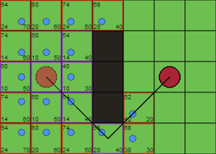

.. _a_star:


Implementação do Algoritmo A*
-----------------------------
Esse relatório tem o objetivo de explicar a implementação do algoritmo A* para a solução de um problema proposto.

Trabalho realizado por Gary M.Silva e José Guilherme Silva de Lima

Explicação teórica do algorítmo
------------------

O A* é um algoritmo de busca em um grafo que, a partir de um nó inicial, tenta encontrar o melhor caminho (caminho com menor custo) para chegar em um nó objetivo sem colidir com os obstáculos encontrados durante o trajeto.

Primeiramente, o algoritmo encontra todos os vizinho de um nó inicial que que não sejam obstaculos, para que sejam visitados. Depois, para cada um deles, é feito um calculo que indica qual é a distância desse nó até o nó objetivo. A fórmula para fazer esse calculo é  f(n) = g(n) + h(n), onde n é o nó atual, f(n) é a distância percorrida por n, g(n) é o custo do nó inicial até n e h(n) é a estimativa do custo do caminho de n até o nó objetivo. Essa função é chamada de função heurística, e é importante ressaltar que não existe uma uma regra para cria-la, ela pode ser qualquer função que receba como parâmetro dois nós e estima a distância entre eles.

O nó vizinho que tiver o menor valor após a aplicação da função heurística deve ser escolhido como nó atual, e todo o processo anterior deve ser repetido a partir dele, até que que o nó atual seja o nó objetivo. Em cada iteração do processo, é importante que seja armazenado quem é o pai do nó atual, para que ao chegar no nó objetivo seja possível traçar o caminho do nó inicial até o nó objetivo.




Problema Proposto
------------------

O problema proposto consiste na implementação do algoritmo A* para encontrar o melhor caminho entre dois pontos em um mapa, sem colidir com nenhum obstaculo.

Para minimizar o problema, foi considerado que o robô que irá utilizar o planejador de caminho somente se movimenta em linha reta e rotaciona 90 graus. (Não se movimenta na diagonal)

O mapa que foi utilizado como referência para a implementação é o mapa abaixo, que é representado como uma matriz em que 0 represanta um nó livre e 0 um obstáculo.


```
0 0 0 0 0 0 0 0 0 0 0 0 1 0 0
0 1 0 0 0 0 0 0 0 0 0 0 1 0 0
0 0 0 0 1 1 1 1 0 0 0 0 0 0 0
0 0 0 0 0 1 0 0 0 0 0 0 0 0 0
1 1 1 0 0 1 0 0 0 0 1 1 1 0 0
0 0 0 0 0 1 0 0 0 0 0 0 0 0 0
0 0 0 1 1 1 0 0 1 1 0 0 0 0 0
0 0 0 0 0 0 0 0 0 0 0 0 1 1 1
0 0 0 0 1 1 1 0 0 0 0 0 0 0 0
0 0 0 0 0 0 0 0 0 0 0 0 0 0 0
0 0 0 1 1 1 0 0 1 1 0 0 0 0 0
0 0 0 0 1 1 1 0 0 0 0 0 0 0 0
0 0 0 0 0 0 0 0 0 1 1 1 1 1 1
0 1 1 1 0 0 0 1 1 1 0 0 0 0 0
0 0 0 0 0 0 0 0 0 0 0 0 0 0 0
```

Implementação
--------

A linguagem escolhida para a implementação da solução foi Python.

A principal e mais importante classe do programa é a classe AStar. Ela é a responsavel pela busca do melhor caminho entre dois nós em um mapa.


```python
class AStar:
    def __init__(self, map):
        self.map = map
        
    def initialize(self, startNode, goal):
        self.path = { startNode: None}
        self.costMap = { startNode: self.estimateDistance(startNode, goal) }
        self.openList = [startNode]
        self.closedList = []
        self.distance = 0

    def nextNodes(self, currentNode):
        i = currentNode[0]
        j = currentNode[1]

        nextNodes = []
        if i > 0 and self.map[i - 1][j] != '1':
            nextNodes.append((i - 1, j))

        if (i + 1) < len(self.map) and self.map[i + 1][j] != '1':
            nextNodes.append((i + 1, j))

        if j > 0 and self.map[i][j - 1] != '1':
            nextNodes.append((i, j - 1))

        if (j + 1) < len(self.map[0]) and self.map[i][j + 1] != '1':
            nextNodes.append((i, j + 1))

        return nextNodes

    def getBest(self):
        currentIndex = 0
        bestHeuristic = self.costMap[self.openList[currentIndex]]

        for index, node in enumerate(self.openList):
            if (self.costMap[node] < bestHeuristic):
                bestHeuristic = self.costMap[node]
                currentIndex = index

        bestNode = self.openList[currentIndex]

        self.openList.remove(bestNode)
        self.closedList.append(bestNode)

        return bestNode
    
    def estimateDistance(self, currentNode, goal):
        return abs(currentNode[0] - goal[0]) + abs(currentNode[1] - goal[1])

    def generatePath(self, node):
        path = [node]
        while self.path[node] != None:
            path.append(self.path[node])
            node = self.path[node]
        return path[::-1]


    def getPath(self, startNode, goal):
        self.initialize(startNode, goal)

        while self.openList:
            currentNode = self.getBest()

            if (currentNode == goal):
                return self.generatePath(currentNode)

            for nextNode in self.nextNodes(currentNode):
                if nextNode not in self.closedList and nextNode not in self.openList:
                    self.openList.append(nextNode)
                    if nextNode not in self.costMap.keys():
                        self.distance += 1
                        self.costMap[nextNode] = self.estimateDistance(nextNode, goal) + self.distance
                        self.path[nextNode] = currentNode

        return self.generatePath(currentNode)
```

Trechos importantes da implementação
-------------------------------------


```python
    def __init__(self, map):
        self.map = map
```

O construtor da classe recebe como parâmetro o mapa que será usado para encontrar a menor distância entre os pontos. Esse mapa será uma matriz.

```python
    def initialize(self, startNode, goal):
        self.path = { startNode: None}
        self.costMap = { startNode: self.estimateDistance(startNode, goal) }
        self.openList = [startNode]
        self.closedList = []
        self.distance = 0
```

O método initialize é chamado somente pela função `getPath`. Ele é responsável por inicializar os atributos que serão utilizados pelos demais métodos. 

- `path`: Dicionário para armazenar os nós percorridos. É inicializado com o nó atual apontando para ninguem. 
- `costMap`: Dicionário para armazenar os de estimativa de distância de cada nó até o destino. Ja é inicializado com o valor do nó inicial.
- `openList`: Lista de nós que devem ser visitados. É inicializado com o nó inicial.
- `closedList`: Nós que ja foram visitados e não devem ser visitados novamente.
- `distância`: Distância percorrida até o momento atual.

```python
    def getPath(self, startNode, goal):
        self.initialize(startNode, goal)

        while self.openList:
            currentNode = self.getBest()

            if (currentNode == goal):
                return self.generatePath(currentNode)

            for nextNode in self.nextNodes(currentNode):
                if nextNode not in self.closedList and nextNode not in self.openList:
                    self.openList.append(nextNode)
                    if nextNode not in self.costMap.keys():
                        self.distance += 1
                        self.costMap[nextNode] = self.estimateDistance(nextNode, goal) + self.distance
                        self.path[nextNode] = currentNode

        return self.generatePath(currentNode)
```

`getPath` é o método principal. Ele faz a inicialização das variaveis através do método `initialize` e começa a busca pelo melhor caminho. Enquanto houvver itens em `openList`, quer dizer que existem nós para serem visitados, portanto o loop deve continuar. O primeiro método a ser chamado é o `getBest`. Ele retorna o melhor valor de heurística entre os nós que estão em `openList`. Na primeira iteração esse nó será o nó inicial. Em `getBest` o melhor nó é encontrado, removido de `openList` e depois adicionado em `closedList`. Caso o melhor nó seja o nó objetivo, quer dizer que o melhor caminho ja foi encontrado, portanto deve ser desenhado o caminho.

Após isso, são percorridos os nós adjacentes ao nó atual. O método `nextNodes`, recebe como parâmetro o nó atual e retorna uma lista com os nós adjacentes, sempre ignorando os obstáculos. Cada nó adjacente, que não esta em `closedList` nem em `openList`, será adicionado em `openList` para que seja visitado, ou seja, o nó passará pelo calculo da estimativa de distância para o nó objetivo através do método `estimateDistance`, e será salvo o seu valor de heurística em `costMap`. A partir dai o loop se repete, até o momento que o nó atual é o nó objetivo e pode ser desenhado o caminho. 
